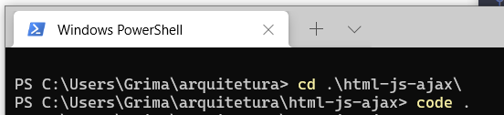
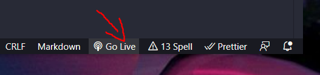

# README #

- Instalar o VSCode.
- Instalar no VSCode a extensao Go Live Server.
 

### URL ###

* [Testar a App](http://localhost:5500/index.html)

- Navegar até a pasta e utilizar o comando "code ."

- Utlizando a extensão GoLive do VSCode para servir conteudo estático.

